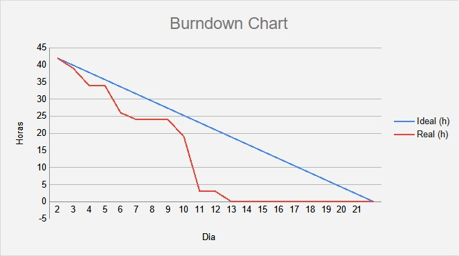

# API: 3º ADS - Little Tech

 

<h1> Aprendizado por Projeto Integrado do 3º semestre da Faculdade de Tecnologia de São José dos Campos - "Professor Jessen Vidal". </h1>

   

<h2> O Projeto 💼 </h2>

 Eu, como usuário, quero que seja desenvolvido um sistema de gerenciamento de usuários, assim como um serviço de autenticação/autorização. Este serviço deve ser implementando utilizando tecnologia de microserviço, e usando recursos e ferramentas da GCP (Google Cloud Platform). Deve ser utilizado container, e implementando em esteira de CI/CD. O sistema deve seguir as boas práticas de desenvolvimento orientado a objetos como, SOLID e Clean Code, e Clean Architecture. Também deverão ser implementados os testes unitátios e de integração, para garantir a qualidade da entrega. A cobertura do código deve ser de pelo menos 80%, devendo ser validado pelo SONAR, ou outra ferramenta de análise. O sistema deve possuir uma interface para gerenciar os usuarios, pemitindo que sejam criados, visualizados, editados e removidos. Deve ainda permitir a atribuição de permissões para cada usuário. O sistema deverá utilizar como tecnologia backend a linguagem NodeJS, em sua versão mais atual, banco de dados PostgreSQL, e para o frontend React.

 

<h2>Objetivo 📌</h2>

 Desenvolver um sistema WEB de gerenciamento de usuários, assim como um serviço de autenticação/autorização. Este serviço deve ser implementando utilizando tecnologia de microserviço, e usando recursos e ferramentas da GCP (Google Cloud Platform). 

 
  
 
<h3> Requisitos Funcionais: </h3>

 • Ao acessar o sistema, login e senha, o usuário deve ser direcionado para a listagem de usuários cadastrados. Caso contrário, deverá ser retornada mensagem de erro, e o usuário deve continuar na tela de login. 

 • Deverá ser possível cadastrar novos usuários. 

 • Deverá ser possível editar usuários já cadastrados. 

 • Deverá ser possível visualizar todos os usuários cadastrados em forma de lista. Os campos apresentados devem ser nome, perfil de acesso, status de criação, e se está ativo. 

 • Deverá ser possível desativar um usuário (exclusão lógica). 

 • Deverá existir a funcionalidade de ‘esqueci minha senha`. Deve ser enviado e-mail com token, para que o usuário possa criar nova senha no sistema. 

  

<h3> Requisitos Não Funcionais: </h3> 

 
 • Documentação de todo o sistema. Modelagem de banco, e código fonte. 

 
 • Manual do usuário. 

 
 • Utilização do GCP. 

 
 • Utilização de ferramentas para CI/CD (Git, GihubAction, Jenkins, Sonar). 

 
 • Criação de componentes para reaproveitamento de código. 

  
  

 
<h2>Cronograma da 3ª Sprint: 📆</h2>
 
 

<h3> • Sprint 3 - 24/04 a 14/05 </h3>

✔️ Funcionalidades do Banco de Dados que complementem as funções Back End.  
✔️ Aperfeiçoamento e funcionalidades avançadas do Back End no sistema.  
 
 

<h2>Demonstração de nossa aplicação 💻</h2> 
 

 

 

<h2>Tecnologias Utilizadas 🔧</h2>
 
• Front-end: React. 
• Back-end: Node.js, TypeScript. 
• Banco de Dados: PostgreSQL. 
• Ferramentas: Github, Visual Studio Code, Discord, Canva. 

               

 
 

<h2>Backlog 📊</h2> 
 O product backlog é uma lista ordenada que tem como função documentar de forma clara todos os requisitos do desenvolvimento de um projeto. Itens que precisem de maior refinamento geralmente têm uma importância menor e ficam mais abaixo no Product Backlog.  
 
 

 
 
<h2>Modelo de dados📑</h2> 
 Um modelo de banco de dados mostra a estrutura lógica de um banco de dados, incluindo as relações e restrições que determinam como os dados podem ser armazenados e acessados.
 
<h5>Modelo de Dados<h5>

 

<h2>Burndown 📈📉 </h2>  
 O Sprint Burndown Chart mostra a comparação entre o trabalho estimado inicialmente no Sprint Planning Meeting com a quantidade restante estimada de trabalho.
 

 

 <h2>Equipe 👾</h2>
 
 Nome|Função|Github|Linkedin 
-----|------|------|---------
Eliézer Lopes  |Desenvolvedor|[@Github](https://github.com/EliezerLopes1)|[@Linkedin](https://www.linkedin.com/in/eli%C3%A9zer-lopes-b89a4124a)
Gabriel Angelis|Desenvolvedor|[@Github](https://github.com/GabrAngelis)|[@Linkedin](https://www.linkedin.com/in/gabriel-luis-de-angelis-b64816237/)
Isabel Reis    |Desenvolvedor|[@Github](https://github.com/IsabelRReis)|[@Linkedin](https://www.linkedin.com/in/isabel-reis-09806920b/)
Mariana Veloso |Desenvolvedor|[@Github](https://github.com/Marih2210)|[@Linkedin](https://www.linkedin.com/in/mariana-veloso-979436231)
Nicolas Pereira|Product Owner|[@Github](https://github.com/NicolasPereira06)|[@Linkedin](https://www.linkedin.com/in/nicolas-bonif%C3%A1cio-426804237/)
Rafaela Cabral |Desenvolvedor |[@Github](https://github.com/RafaelaCabral)|[@Linkedin](https://www.linkedin.com/in/rafaela-vieira-cabral-733b5922a)
Thyago Silveira|Scrum Master|[@Github](https://github.com/Thyaguixx)|[@Linkedin](https://www.linkedin.com/in/thyago-silveira-276984237/)

 
 
 
